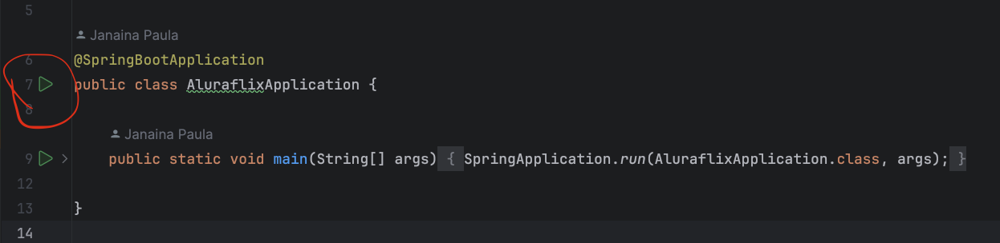

# AluraFlix

Esse é um projeto de backend para um site de videos do Alura. Esse é um sistema backend desenvolvido para o primeiro 
challenge do Alura

### Tecnologias

Optamos por trabalhar com as seguintes tecnologias:

* Java 17
* Maven
* Mysql
* Docker

### Como rodar o projeto localmente

Para rodar o projeto localmente, primeiro precisamos levantar um container docker com o bancos de dados. Para isso
precisamos rodar na pasta raiz do projeto o seguinte comando:

``` bash
docker-compose up -d
```

Como o container rodando, podemos executar a classe main do projeto, o ```AluraflixApplication```, como mostra a imagem 
abaixo



## Autores
- [Janaina Paula](https://github.com/JanainaPaula)
- [Julia Pongeluppi](https://github.com/JuPonge)
